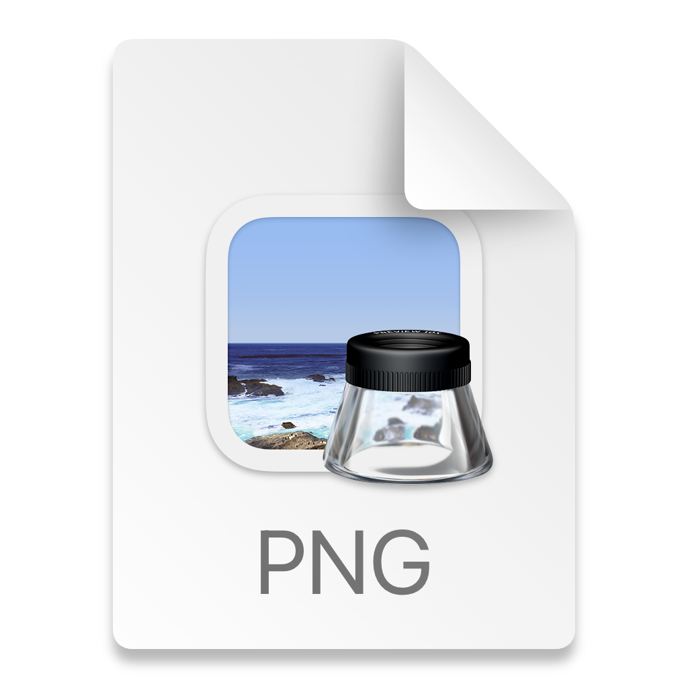

## GraphQL Practice - Space X

This react app was created to practice making queries to a GraphQL API.

## Available Scripts

In the project directory, you can run:

### `npm start`

Runs the app in the development mode.\
Open [http://localhost:3000](http://localhost:3000) to view it in the browser.

## Usage

Select a mission from the available options. The selected mission makes a query to display the mission details.

